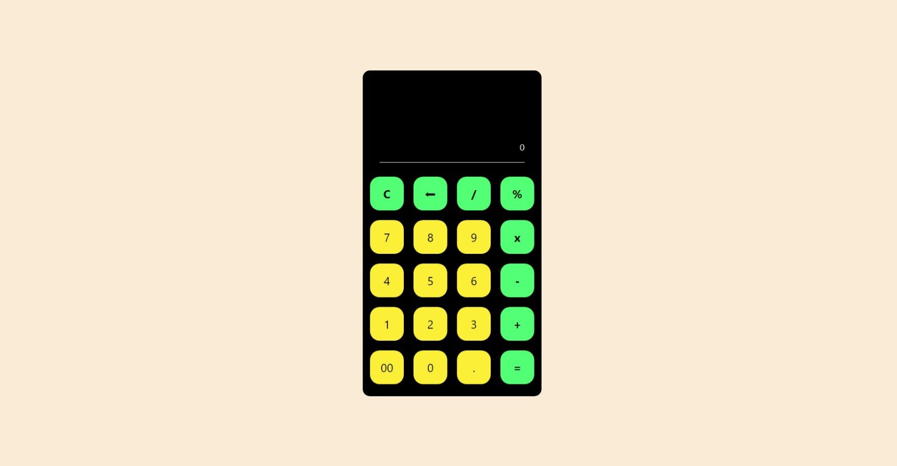
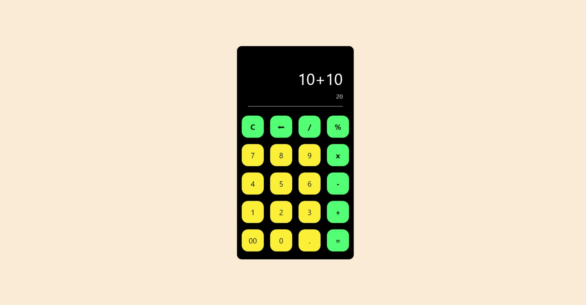

#  Calculadora
- Essa é uma calculadora que utilizamos muito no nosso dia a dia!
  
## Sobre o Projeto

- Esse projeto é uma **calculadora**, que hoje em dia é uma **ferramenta muito utilizada** por todos por conta da sua **facilidade, agilidade e precisão**.

## Linguagens

- HTML
- CSS
- JavaScript

## Como testar

- **1.** clone este repositório;
- **2.** Abra com VsCode;
- **3.** Acesse o arquivo **index.html** e o execute via Live Server.

# Prints das Telas

## Tela inicial:

## Tela resultado:

